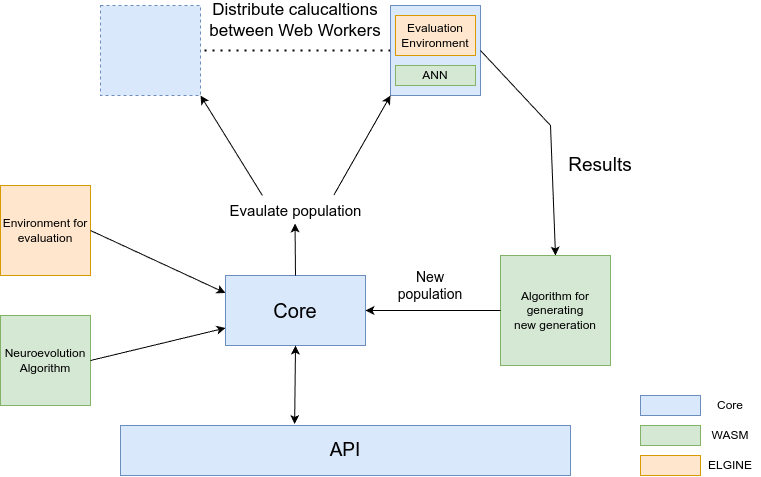

# asm-ne-gym
WebAssembly-Neuroevolution-Gym (asm-ne-gym) is library/tool which make development and training of neuroevoltuion easier in web development environmnet.
Library aim to give best performance and also plug-in implementation of your own environment or neuroevolution algorithm.
Library utilize most out of web technologies like Web Workers and Web Assembly, to give best performance.
Neuroevolution algorithms are written in C++ and then compiled with emscripten to WASM. This way you can reuse your C++ algorithm elsewhere.

Builded preview page from `@master` is available on https://prostenobody.github.io/asm-ne-gym/

Structure
----
 - `core/` - contains key components of library, which glue everything together. You can import `AsmNeGym.ts` class to use in demo page
 - `element-engine/` - prepared engine which is optional to use, but can save you some time creating environment
 - `wasm/` - all c++ code, which is prepared for building neuroevolution algorithm
 - `demo/` - showcase of example where we have existing environments and neuroevolution algorithm connected to library
(you can replace this folder, if you want to build your application, on top of this repo structure)
 - `build_wasm/` - builded files from emscripten tool, which contains glue script `asm_core.js` and wasm binary `asm_core.wasm`,
these are later used to compile final source code
 - `build/` - folder which contains final source code, after build script. You can preview these with `make webpage_preview` or copy to your server

If you are using library, you should only operate in `demo/` folder, but there are two special folders, which cannot be removed and specific files need to be present there.

`demo/modules/{name}.ts` is place, where you want to store your environment run script. Which is then use by web workers. More on that in `Implementation` section.

Second folder is `wasm/algorithms/{name}.hpp` (note that `.hpp` is required, not `.cpp`). That contains prepared neuroevolution algorithms, which can be used
for training. These algorithms are then available, under their name in `AsmCore`. More on that in `Implementing...` section

Tool requirments
----
With `docker`, you run whole project build, because there is prepared `make docker` command,
which will build WASM + typescript and then will make demo page available on port `3000`.
Otherwise you need to have fallowing tools, for successfully using `make` commands

 - `emcc` - emscripten for compiling C++ code to wasm (emcc tool must be avalible in $PATH) - https://emscripten.org/docs/getting_started/downloads.html
 - `node + npm` - for running scripts and package managment - https://nodejs.org/en/download

Note that whole library is tested on linux, might not work on other machines and we recomend to use docker instead.

Makefile commands
----
You can run prepared commands via `make` command. Feel free to explore what they do in `Makefile`. I will summarize only core `make` commands.
 - `all` - initialize, compile and run project
 - `types` - because c++ and typescript are typped languages, with this command you can check if all syntax is correct
 - `wasm_compile` - this command will compile C++ code in `wasm/` to `build_wasm/`
 - `typescript_compile` - final build via vite. Output files will be present in `build/` (note that `wasm_compile` need to run before `typescript_compile`)
 - `watch_wasm` - `inotifywait` is required. This command will be checking your `wasm/` folder, and it will recompile if something change.
Useful to use with `typescript_watch`.
 - `typescript_watch` - watch `.ts` files, and recompile if some change
 - `webpage_preview` - run preview page from `build/` folder

Implementing own environment
----
If you want implement your own environment, you need to create module. It is required to create module in `demo/modules/{moudle_name}.ts`.
That's because web worker have hardcodded path to this folder. After that, you need to use `{module_name}` (without '.ts') as constructor parameter in `AsmNeGym()`.
This way, asm-ne-gym know, which file is need to load. File itself should be exported as `core/types/AsmNeGym.ts:AsmNeModule` type.
This way, it will contain correct module export. You can checkout demo evironment to see how they were implemented.

Implementing own neuroevolution algorithm
----
If you want implement your own neuroevoltuion algorithm, you need to create new file in `wasm/algorithms/{algorithm_name}.hpp` (`.hpp` is required).
Then you need to create class, which will implement `wasm/CNeuroevolutionBase.hpp`, and implement all required methods.
After that, you need to include your algorithm in `wasm/AsmCore.cpp`.
In that file you need to include your `.hpp` file and add your algorithm into constructor switch. So it will create instance of that algorithm, with `make_unique`.
You can follow how other algorithms are integrated, for guidance.

Don't remember to suggest MR for implementing your algorithm into official repo. So others can use it. ;)

Description of train process
----

How should new neuroevolution algorithm work. GUIDE
----
TODO - for now, this process is told in my bachlor thesis

Troubleshooting
----
TODO